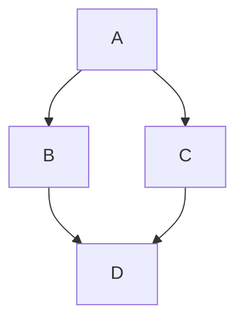
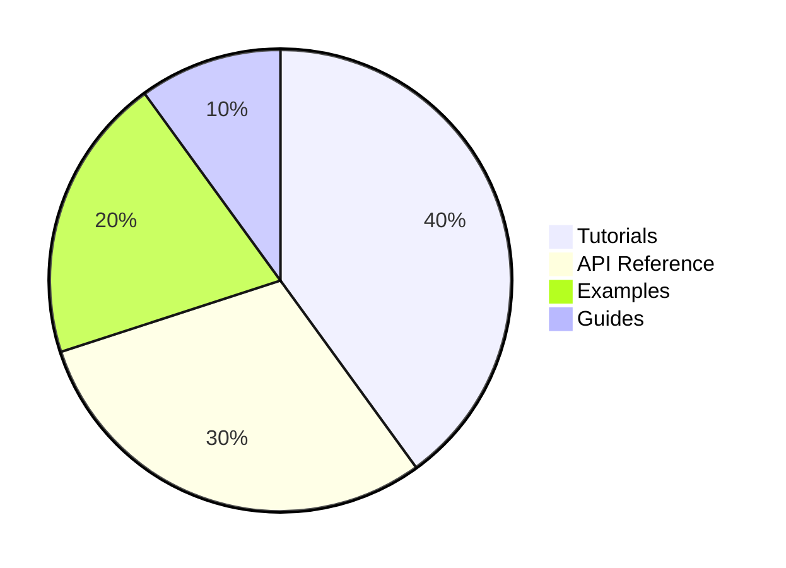
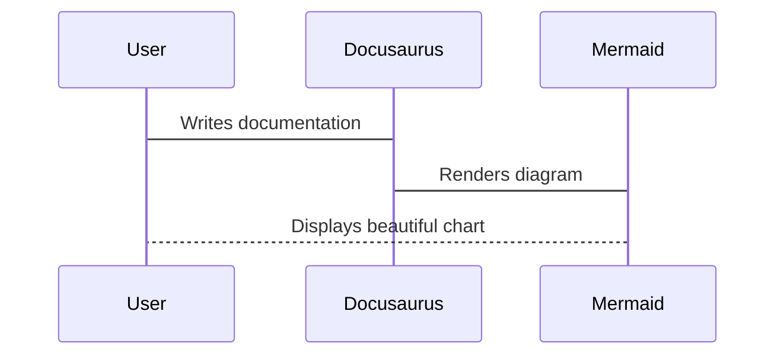
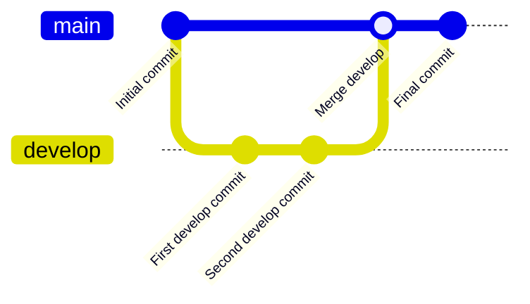

import Mermaid from '@theme/Mermaid';
import { useState } from 'react';

<a id="mermaid-config"></a>

# Testing Mermaid Configurations

As part of the technical evaluation criteria, features such as chart creation (Mermaid), folder structures, cross-referencing, and new findings were tested in order to identify the strenghts and weaknesses of the Docusaurus documentation generator.

## Creating Mermaid Diagrams

Docusaurus offers several ways to create Mermaid charts, ranging from simple static diagrams in Markdown to fully diagrams in React/MDX.

The table below summarizes the main options to be considered in this test:

| Method | Best For | Key Features | Configuration Complexity |
|:------:|:--------:|:------------:|:----------------:|
| **Native Mermaid Support** | Simple, client-side diagrams. | - Easy markdown integration; Automatic light/dark themes; Support for ELK (*Eclipse Layout Kernel*) layout engine. | Low |
| **Custom Mermaid Component** | Dynamic diagrams that need to be generated based on user interaction or external data. | - Full control over rendering logic; Can be used with external data sources or state; Integrates into MDX pages. | Medium/High |


### 1. Testing **Native Mermaid**

Diagrams can be rendered within a code block by following these steps:

- Enabling the Oficial Mermaid Theme

```js title="docusaurus.config.js"
const config = {
  title: 'Hello Docs',
//new config
  markdown: {
    mermaid: true,
  },

  themes: ['@docusaurus/theme-mermaid'],
};
```

- Installing the Mermaid Theme

```bash
npm install @docusaurus/theme-mermaid
```

- Generating Diagrams

**Simple Flow Chart:**



**Pie Chart:**



**Sequence Diagram:**

**Git graph** is also natively supported:



Code:

```bash

:::tip
Docusaurus is sensitive to quotes for commit IDs. Every `id: value` that has spaces must be wrapped in double quotes (e.g, `commit id: "Initial commit"`). Otherwise, Mermaid will fail to render.
:::

### 2. Testing **Custom Mermaid Component**

To implement a custom Mermaid component in Docusaurus, it is necessary to install a *Mermaid theme* and enable it in the `docusaurus.config.js` file in order to use the `@theme/Mermaid` component within MDX files. However, these configurations had already been completed in the previous native Mermaid setup ([docusaurus-plugin-structurizr](https://timkolberger.github.io/docusaurus-plugin-structurizr/docs/#:~:text=Add%20the%20plugin%20to%20your%20Docusaurus%20project.,need%20to%20install%20the%20official%20mermaid%20theme.)).

Therefore, to create custom Mermaid components, it only needs to build diagrams using JavaScript variables, props (*arguments passed into React components*), arrays, API data, or reusable React components, instead of writing static Mermaid blocks. 

For example:

#### Dynamic Workflow Diagram

```MDX
<Mermaid
   value={`
     graph TD;
         Start([Begin Process]) --> Check{Validation};
         Check -->|Pass| Process[Execute Task];
         Check -->|Fail| Error[Handle Error];
         Process --> Complete([Complete]);
         Error --> Retry{Retry?};
         Retry -->|Yes| Check;
         Retry -->|No| Complete;

         style Start fill:#9f9,stroke:#333
         style Complete fill:#9f9,stroke:#333
         style Error fill:#f99,stroke:#333
   `}
/>

```

<Mermaid
   value={`
     graph TD;
         Start([Begin Process]) --> Check{Validation};
         Check -->|Pass| Process[Execute Task];
         Check -->|Fail| Error[Handle Error];
         Process --> Complete([Complete]);
         Error --> Retry{Retry?};
         Retry -->|Yes| Check;
         Retry -->|No| Complete;

         style Start fill:#9f9,stroke:#333
         style Complete fill:#9f9,stroke:#333
         style Error fill:#f99,stroke:#333
   `}
/>

#### Interactive Authentication Flow

```MDX
export function AuthDiagram() {
   const [authType, setAuthType] = useState('jwt');

   const getSequenceDiagram = () => {
     if (authType === 'jwt') {
       return `
         sequenceDiagram
             participant U as User
             participant C as Client
             participant A as Auth Server
             participant API as API Gateway

             U->>C: Login credentials
             C->>A: Authenticate
             A-->>C: JWT Token
             C->>API: Request with JWT
             API->>API: Validate Token
             API-->>C: Response
             C-->>U: Show data
       `;
     } else {
       return `
         sequenceDiagram
             participant U as User
             participant C as Client
             participant S as Session Store
             participant API as API

             U->>C: Login credentials
             C->>S: Create session
             S-->>C: Session ID cookie
             C->>API: Request with cookie
             API->>S: Validate session
             API-->>C: Response
             C-->>U: Show data
       `;
     }
   };

   return (
     <div>
       <div style={{ marginBottom: '20px' }}>
         <button onClick={() => setAuthType('jwt')} style={{
marginRight: '10px' }}>
           JWT Authentication
         </button>
         <button onClick={() => setAuthType('session')}>
           Session-Based Auth
         </button>
       </div>
       <p><strong>Current Authentication Method:</strong> {authType.toUpperCase()}</p>
       <Mermaid value={getSequenceDiagram()} />
     </div>
   );
}

<AuthDiagram />

```
export function AuthDiagram() {
   const [authType, setAuthType] = useState('jwt');

   const getSequenceDiagram = () => {
     if (authType === 'jwt') {
       return `
         sequenceDiagram
             participant U as User
             participant C as Client
             participant A as Auth Server
             participant API as API Gateway

             U->>C: Login credentials
             C->>A: Authenticate
             A-->>C: JWT Token
             C->>API: Request with JWT
             API->>API: Validate Token
             API-->>C: Response
             C-->>U: Show data
       `;
     } else {
       return `
         sequenceDiagram
             participant U as User
             participant C as Client
             participant S as Session Store
             participant API as API

             U->>C: Login credentials
             C->>S: Create session
             S-->>C: Session ID cookie
             C->>API: Request with cookie
             API->>S: Validate session
             API-->>C: Response
             C-->>U: Show data
       `;
     }
   };

   return (
     <div>
       <div style={{ marginBottom: '20px' }}>
         <button onClick={() => setAuthType('jwt')} style={{
marginRight: '10px' }}>
           JWT Authentication
         </button>
         <button onClick={() => setAuthType('session')}>
           Session-Based Auth
         </button>
       </div>
       <p><strong>Current Authentication Method:</strong> {authType.toUpperCase()}</p>
       <Mermaid value={getSequenceDiagram()} />
     </div>
   );
}

<AuthDiagram />


#### Dynamic Performance Metrics

```MDX
export function DynamicChart() {
   const [metrics, setMetrics] = useState({
     q1: 65,
     q2: 75,
     q3: 85,
     q4: 95
   });

   const mermaidCode = `
     %%{init: {'theme': 'base', 'themeVariables': { 'primaryColor': 
'#bb2528'}}}%%
     pie title Quarterly Performance Metrics
         "Q1: ${metrics.q1}%" : ${metrics.q1}
         "Q2: ${metrics.q2}%" : ${metrics.q2}
         "Q3: ${metrics.q3}%" : ${metrics.q3}
         "Q4: ${metrics.q4}%" : ${metrics.q4}
   `;

   return (
     <div>
       <Mermaid value={mermaidCode} />
       <div style={{ marginTop: '20px' }}>
         <button onClick={() => setMetrics({ q1: 70, q2: 80, q3: 90, q4: 
98 })}>
           Update Metrics
         </button>
       </div>
     </div>
   );
}

<DynamicChart />

```

export function DynamicChart() {
   const [metrics, setMetrics] = useState({
     q1: 65,
     q2: 75,
     q3: 85,
     q4: 95
   });

   const mermaidCode = `
     %%{init: {'theme': 'base', 'themeVariables': { 'primaryColor': 
'#bb2528'}}}%%
     pie title Quarterly Performance Metrics
         "Q1: ${metrics.q1}%" : ${metrics.q1}
         "Q2: ${metrics.q2}%" : ${metrics.q2}
         "Q3: ${metrics.q3}%" : ${metrics.q3}
         "Q4: ${metrics.q4}%" : ${metrics.q4}
   `;

   return (
     <div>
       <Mermaid value={mermaidCode} />
       <div style={{ marginTop: '20px' }}>
         <button onClick={() => setMetrics({ q1: 70, q2: 80, q3: 90, q4: 
98 })}>
           Update Metrics
         </button>
       </div>
     </div>
   );
}

<DynamicChart />

:::tip
Since dynamic Mermaid diagrams with variables supporting MDX are prone to failed because MDX's parser is very strict about JavaScript syntax, import attributes, special characters, and import/export syntax. 

Instead of placing `import` statements inside JSX expression, they should be placed at the top of this page, **Testing Configurations**.

```javascript
import Mermaid from '@theme/Mermaid';
import { useState } from 'react';
```
:::


#### Dynamic Git Workflow Visualization

    However, trying to generate another advance diagram such as a Git Workflow, there is a *MDX compilation* error, due to Docusaurus could not parse import/export with acorn.

    Example code:

```bash
import Mermaid from '@theme/Mermaid';
import { useState } from 'react';
{(() => {
   const mainBranch = "main";
   const devBranch = "develop";
   const featureBranch = "feature/user-auth";

   return (
     <Mermaid value={`
       gitGraph
          commit id: "Initial commit"
          commit id: "Setup project"
          branch ${devBranch}
          checkout ${devBranch}
          commit id: "Add CI/CD"
          branch ${featureBranch}
          checkout ${featureBranch}
          commit id: "Implement login"
          commit id: "Add JWT"
          checkout ${devBranch}
          merge ${featureBranch} id: "Merge feature"
          checkout ${mainBranch}
          merge ${devBranch} id: "Release v1.0"
          commit id: "Production deploy"
     `} />
   );
})()}
```
Error Details:


As workaround to avoid mixing complex *JavaScript* with *MDX*, a separate component **jsx** file was created in `./src/components/DynamicGitDiagram.jsx`

```jsx
import React from 'react';
import Mermaid from '@theme/Mermaid';

export default function DynamicGitDiagram({ mainBranch = "main", devBranch = "develop", featureBranch = "feature/new" }) {
   const diagramCode = `
     gitGraph
        commit id: "Initial"
        branch ${devBranch}
        checkout ${devBranch}
        commit id: "Setup"
        branch ${featureBranch}
        checkout ${featureBranch}
        commit id: "Feature work"
        checkout ${devBranch}
        merge ${featureBranch}
        checkout ${mainBranch}
        merge ${devBranch}
   `;

   return <Mermaid value={diagramCode} />; }
```
And imported using it in this `.md` file:

```bash
import DynamicGitDiagram from '../../src/components/DynamicGitDiagram';

<DynamicGitDiagram featureBranch="feature/user-auth" />
```

import DynamicGitDiagram from '../../src/components/DynamicGitDiagram';

<DynamicGitDiagram featureBranch="feature/user-auth" />


## Reorder Sections and Pages

**Control Category**

To manage the order of each category in the sidebar, each section includes a ```_category_.json``` file inside its folder. This file specifies the position number of the category. For example, the ***technical-evaluation*** folder has position number 2.

- Folder/category restructuring:

  ```
    docs/
    └─ technical-evaluation/
        ├─ _category_.json
        └─ installation.md
        └─ testingconfig.md
        └─ UXevaluation.md
  ```

    

Alternatively, it is posible to define the order by using front matter at the top of a page with the `sidebar_position` parameter, as shown in ***intro.md***.

- Control order with front matter:
    ```
    docs/
    └─ technical-evaluation
    └─ intro.md
  ```

    


Docusaurus also supports the **autogenerated sidebar** option, in which each folder automatically becomes a sidebar category and each file becomes a documentation link.

In short, it creates a list of items of type `doc` or `category`, allowing multiple autogenerated items from multiple directories to be combined and interleaved with regular sidebar items at the same sidebar level.


For example, following the Docusaurus guide ([Autogenerated](https://docusaurus.io/docs/sidebar/autogenerated?utm_source=chatgpt.com)):

Asumming a file structure such as:

```
    docs
    ├── api
    │   ├── product1-api
    │   │   └── api.md
    │   └── product2-api
    │       ├── basic-api.md
    │       └── pro-api.md
    ├── intro.md
    └── tutorials
        ├── advanced
        │   ├── advanced1.md
        │   ├── advanced2.md
        │   └── read-more
        │       ├── resource1.md
        │       └── resource2.md
        ├── easy
        │   ├── easy1.md
        │   └── easy2.md
        ├── tutorial-end.md
        ├── tutorial-intro.md
        └── tutorial-medium.md
```
And defining an autogenerated sidebar, the `sidebars.js` file could generate a layout with the `api` and `tutorials` folders:

```
    docs
    ├── api
    │   ├── ...
    │   └── ...
    ├── ...
    └── tutorials
        ├── ...
        ├── ...
```

```js
export default {
  mySidebar: [
    'intro',
    {
      type: 'category',
      label: 'Tutorials',
      items: [
        'tutorial-intro',
        {
          type: 'autogenerated',
          dirName: 'tutorials/easy', // Generate sidebar slice from docs/tutorials/easy
        },
        'tutorial-medium',
        {
          type: 'autogenerated',
          dirName: 'tutorials/advanced', // Generate sidebar slice from docs/tutorials/advanced
        },
        'tutorial-end',
      ],
    },
    {
      type: 'autogenerated',
      dirName: 'api', // Generate sidebar slice from docs/api
    },
    {
      type: 'category',
      label: 'Community',
      items: ['team', 'chat'],
    },
  ],
};
```
This resolves into:

- Two files in `docs/tutorials/easy`, such as `easy1` and `easy 2`
- Two files in `docs/tutorials/advanced`, including the `read-more` subcategory with `resource1` and `resource2` subfiles

```
    docs
    ├── ...
    └── tutorials
        ├── advanced
        │   ├── advanced1.md
        │   ├── advanced2.md
        │   └── read-more
        │       ├── resource1.md
        │       └── resource2.md
        ├── easy
        │   ├── easy1.md
        │   └── easy2.md
```

- And two folders in `docs/api`: `product1-api` and the `product2-api`

```
    docs
    ├── api
    │   ├── product1-api
    │   │   └── api.md
    │   └── product2-api
    │       ├── basic-api.md
    │       └── pro-api.md
    ├── ...
```
Equivalent manual configuration:

```js

export default {
  mySidebar: [
    'intro',
    {
      type: 'category',
      label: 'Tutorials',
      items: [
        'tutorial-intro',
        // Two files in docs/tutorials/easy
        'easy1',
        'easy2',
        'tutorial-medium',
        // Two files and a folder in docs/tutorials/advanced
        'advanced1',
        'advanced2',
        {
          type: 'category',
          label: 'read-more',
          items: ['resource1', 'resource2'],
        },
        'tutorial-end',
      ],
    },
    // Two folders in docs/api
    {
      type: 'category',
      label: 'product1-api',
      items: ['api'],
    },
    {
      type: 'category',
      label: 'product2-api',
      items: ['basic-api', 'pro-api'],
    },
    {
      type: 'category',
      label: 'Community',
      items: ['team', 'chat'],
    },
  ],
};

```
> Therefore, the autogenerate source directories themselves do not become categories automatically; only the items they contain do, such as those inside `api`and `tutorials`. This is what is meant by a **sidebar slice**.


## Link Configurations

Linking from one documentation page to another in Docusaurus is very flexible. It supports relative paths, syntax based on document IDs, and auto-resolution using the filename as the doc ID.

    - Link to a document using its relative path: [Installation Section](installation.md)

        ```md
        [Installation Section](installation.md)
        ```
    
    - Link to a section from another page: [Installation Section](./installation.md#installation-considerations)

        ```md
        [Installation Section](./installation.md#installation-considerations)
        ``

    - Link to a section within the same document using an anchor: [Link Configurations](#link-configurations)

        ```md
        [Link Configurations](#link-configurations)
        ```

        

    - Link syntax automatically resolves using the *filename as the doc ID*, and links continue to work even if the file is moved, as long as the *doc ID* remains unchanged and is not overriden it in the front matter.

        For example, according to the current file structure:

        ```
        docs/
        └─ technical-evaluation/
            └─ installation.md
            └─ testingconfig.md
            └─ UXevaluation.md
        └─ intro.md
        ```
        By default, the doc ID for `intro.md` is `intro`, and for files inside `technical-evaluation`, such as `installation.md`, the doc ID is `installation`.

        Supposse that `technical-evaluation/UXevaluation.md` is moved to another location. As long as the doc ID remains unchanged, links that reference the doc ID will continue to work.

        ```
        [UX](technical-evaluation/UXevaluation)  <!-- still works! -->
        ```

    -  Use of standard Markdown link syntax for external links:

        [GitHub Repository](https://github.com/emilarim/hello-docs).

        ```md
        [GitHub Repository](https://github.com/emilarim/hello-docs)
        ```
    - Links based on the title of a document instead of the file path or doc ID:

        - For links within the same page, it is necessary to use a *heading anchor*:

            ```md
            <a id="mermaid-config"></a>

            # Testing Mermaid Configurations
            ```
            Then, Docusaurus automatically links like this:

            ```md
            See [Testing Mermaid Configurations](#mermaid-config) for an overview.
            ```      
            
            **See [Testing Mermaid Configurations](#mermaid-config) for an overview.**
        
        - For auto-resolution by title between different documents, by default the doc ID is the relative path without `.md`. 
        
            For example, to link to the section *Installation Considerations* in `installation.md` using the doc ID `installation`:

            ```md
            See [Installation Considerations](installation) for an overview.
            ``` 

            **See [Installation Considerations](installation) for an overview.**

On the other hand, when a File is renamed or moved, Docusaurus detects the issue and reports an error in the console:


The platform prevents silent features and control this behavior by default using the configuration option ```onBrokenLinks: 'throw``` in docusaurus.config.js.


## Page Composition (Content)

Docusaurus has built-in support for MDX, in order to write JSX within Markdown files and render them as React components.

### 1. Creating Warning Boxes

The content alerts such as warnings, infos, and note boxes are part of the MDX *admonitions* that support simple Markdown or MDX syntax. 

```markdown
:::warning
This is a warning!
:::
```
:::warning
This is a warning!
:::

### 2. Creating notebox as Reusable Snippets

For documents supporting only `.md` files, Docusaurus treats them as MDX under the hood, so it is possible to access to all the same features without changing the file extensions for `.mdx`.

For reusable content to use accross multiple files:

- A partial file is created `_NoteBox.md` using a prefix with `_` to prevent it from becoming a page:


    ```
    docs/
    └─ technical-evaluation/
        └─ _category_.json
        └─ _NoteBox.md
        └─ installation.md
        └─ testingconfig.md
        └─ UXevaluation.md
    └─ intro.md
    ```
- Use a simple script:

    ```markdown
        <div style={{
    backgroundColor: 'var(--ifm-color-info-contrast-background)',
    borderLeft: '6px solid var(--ifm-color-info)',
    borderRadius: 'var(--ifm-global-radius)',
    padding: '1rem',
    marginBottom: '1rem'
        }}>
        <strong>📝 Note:</strong>
        <div>
            {props.children}
        </div>
        </div>
    ```
- Import and use it in any `.md` file:

    ```md
    import NoteBox from './_NoteBox.md';

    <NoteBox>
    THIS IS A NOTEBOX SNIPPET!
    </NoteBox>

    ```

import NoteBox from './_NoteBox.md';

<NoteBox>
THIS IS A NOTEBOX SNIPPET!
</NoteBox>

It is also possible to reuse component such as an interactive *Test button* and embed it directly in the Markdown files:

- Creating a new file at `src/components/TestButton.jsx`

- Importing and use it as a React component directly

*Here is a live interactive button built with React*

import TestButton from '../../src/components/TestButton';

<TestButton />

## Content Authoring Experience

### 1. Code blocks

Docusaurus supports syntax-highlighted code blocks (*Java, XML, YAML, Gradle, shell*) through the built-in [Prism](https://docusaurus.io/docs/markdown-features/code-blocks) theme by using triple backticks (**```**) followed by the language name, for example:

```bash
    ```java
    public class Hello {
      public static void main(String[] args) {
        System.out.println("Hello Docusaurus!");
      }
    }

```

- Java

```java
public class Hello {
  public static void main(String[] args) {
    System.out.println("Hello Docusaurus!");
  }
}
```

- XML

```xml
<note>
  <to>User</to>
  <message>Hello world!</message>
<note>
```
- Yaml

```yaml
server:
  port: 8080
  host: localhost
```

- Gradle

```gradle
implementation 'org.hellodocsframework.boot:hello-docs-starter-web'
```

:::tip
If the **Prism** theme is not included, it is necessary to add the following line to the ```docusaurus.config,js``` file:

```js
import { themes as prismThemes } from 'prism-react-renderer';
```
:::

### 2. Tabbed Code Blocks

Tabbed code blocks (e.g., Maven and Gradle) are supported using the built-in [Tabs](https://docusaurus.io/docs/markdown-features/tabs) and `<TabItem>` components, which can be used directly in Markdown thanks to MDX:

```md
    import Tabs from '@theme/Tabs';
    import TabItem from '@theme/TabItem';

    <Tabs>
    <TabItem value="car" label="Car 🚗" default>
        This is a car 🚗
    </TabItem>

    <TabItem value="bus" label="Bus 🚌">
        This is a bus 🚌
    </TabItem>

    <TabItem value="truck" label="Truck 🚚">
        This is a truck 🚚
    </TabItem>
    </Tabs>
```

import Tabs from '@theme/Tabs';
import TabItem from '@theme/TabItem';

<Tabs>
  <TabItem value="car" label="Car 🚗" default>
    This is a car 🚗
  </TabItem>

  <TabItem value="bus" label="Bus 🚌">
    This is a bus 🚌
  </TabItem>

  <TabItem value="truck" label="Truck 🚚">
    This is a truck 🚚
  </TabItem>
</Tabs>

### 3. Collapsible sections

Docusaurus natively support collapsible sections in Markdown/MDX using `details/summary` HTML tags or React components in MDX.

```bash
<details>
  <summary>Click to expand</summary>
    Data
</details>
```

<details>
  <summary>Click to expand</summary>

HELLO DOCS, hidden content here!

- Item 1
- Item 2

```bash
echo "Hello Docusaurus"
```

</details>

### 4. Badges or Labels

Docusaurus does not include specific built-in badge or label components, but badges can be added using several methods, primarily through MDX components, CSS styling via [Infima](https://docusaurus.io/docs/styling-layout), versioning configuration, and front matter tagging.

- Using small images from a badge service such as [shields.io](https://shields.io/)


## Security Concerns

After installing the package `@docusaurus/theme-mermaid` in the Node.js /npm ecosystem, **19** high severity vulnerabilities were reported. These vulnerabilities typically originate from transitive dependencies (*dependencies of dependencies*).


Running the `npm audit` command helps to identify which dependencies contain vulnerabilities:


> **[Download the detailed log](/logs/npmAuditReport.txt)**


### Analyzing Security Vulnerabilities

 Based on the NPM Audit Vulnerability Report: 

#### Root Vulnerability

| Severity | Package | Version | Issue | Fix Available |
|----------|---------|---------|-------|---------------|
| High | serialize-javascript | ≤ 7.0.2 | RCE via RegExp.flags and Date.prototype.toISOString() | `npm audit fix --force` |

#### Dependency Chain Impact

| Direct Package | Vulnerable Version | Depends On | Current Status |
|----------------|-------------------|------------|----------------|
| copy-webpack-plugin | 4.3.0 - 13.0.1 | serialize-javascript | Vulnerable |
| css-minimizer-webpack-plugin | ≤ 7.0.4 | serialize-javascript | Vulnerable |

#### Affected Docusaurus Packages

| Package | Affected Versions | Notes |
|---------|-------------------|-------|
| **@docusaurus/bundler** | All versions | Depends on vulnerable copy-webpack-plugin and css-minimizer-webpack-plugin |

#### Packages Dependent on @docusaurus/core

| Package | Affected Versions | Dependencies |
|---------|-------------------|--------------|
| @docusaurus/core | ≤0.0.0-6119, 3.5.2-canary-6121 - 3.5.2-canary-6131, ≥3.6.0-canary-6132 | Depends on @docusaurus/bundler |

#### Core Plugins Affected

| Plugin Category | Package Name | Affected Versions |
|-----------------|--------------|-------------------|
| **Content Plugins** | @docusaurus/plugin-content-blog | ≤0.0.0-6119, 3.5.2-canary-6121 - 3.5.2-canary-6131, ≥3.6.0-canary-6132 |
| | @docusaurus/plugin-content-docs | Same as above |
| | @docusaurus/plugin-content-pages | Same as above |
| **Theme Plugins** | @docusaurus/theme-classic | Same as above |
| | @docusaurus/theme-mermaid | Same as above |
| | @docusaurus/theme-search-algolia | Same as above |
| **SEO & Analytics** | @docusaurus/plugin-google-analytics | Same as above |
| | @docusaurus/plugin-google-gtag | Same as above |
| | @docusaurus/plugin-google-tag-manager | Same as above |
| | @docusaurus/plugin-sitemap | Same as above |
| **Utility Plugins** | @docusaurus/plugin-debug | Same as above |
| | @docusaurus/plugin-css-cascade-layers | Same as above |
| | @docusaurus/plugin-svgr | Same as above |

#### Preset Package

| Package | Affected Versions | Dependencies |
|---------|-------------------|--------------|
| @docusaurus/preset-classic | ≤0.0.0-6119, 3.5.2-canary-6121 - 3.5.2-canary-6131, ≥3.6.0-canary-6132 | Depends on all core and content plugins listed above |

#### Summary Impact

| Metric | Count |
|--------|-------|
| **Total Vulnerabilities** | 19 (High severity) |
| **Root Vulnerable Package** | 1 (serialize-javascript) |
| **Direct Dependencies Affected** | 2 (copy-webpack-plugin, css-minimizer-webpack-plugin) |
| **Docusaurus Packages Affected** | 15+ |
| **Breaking Change Required** | Yes (will install @docusaurus/core@3.5.2) |

### Recommended Actions to Follow

1. Try to fix first

Run `npm audit fix` to update *only compatible dependency versions*, respect the *version ranges defined in `package.json`*, avoid *breaking changes*, and install *minor or patch updates only.*

    

2. Update Docusaurus Core

If vulnerabilities remain, the next step is to update Docusaurus Core:

    

3. Last resort (may include breaking changes)
Run `npm audit fix --force` to allow *major upgrades*, and modify the dependency tree *drastically*.

> As a precaution, the Docusaurus website on GitHub was updated. If necessary, revert changes to restore functionality.

### Results and Findings

1. After running `npm audit-fix --force`, the audit report registered **17** vulnerabilities (13 moderate, 4 high), representing a significant reduction in high-severy alerts.

    

    However, the website experienced loading issues:

    

2. Starting the development server reported errors due to unrecognized fields `("future.v4",)` in `docusaurus.config.js`.

    

3. Running `npm audit fix` again, following the audit report's recommendations, made no further changes.

    

4. Upgrading Docusaurus to the latest version restored the initial state, with the 19 high-severity vulnerabilities returning.

    

    

5. A warning related to critical dependency in ```vscode-languageserver-types``` appears after upgrading.

    

6. Communication with GitHub portal to upgrade the website was disabled and required re-establishing authentication. 

**CONCLUSIONS**

Although the platform can identify and report vulnerabilities, it cannot reliably fix them using `npm audit fix` or `npm audit fix--force`. The `--force` flag may install modules outside the stated dependency range, which can generate errors that prevent the server from starting.

As a countermeasure, it is necessary to:

- Inspect each dependency with reported vulnerabilities.

- List all transitive dependencies.

- Check the repository for versions that include a fix.

- Update dependencies without altering unrelated packages.

- Test the website thoroughly to ensure correct functionality.


