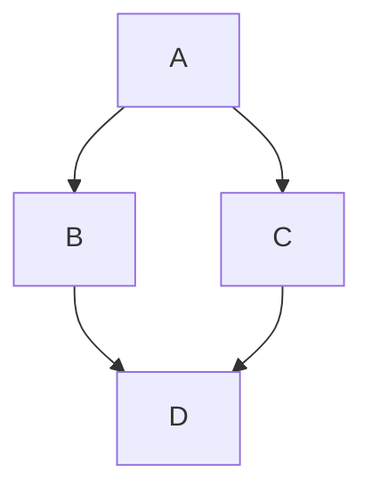
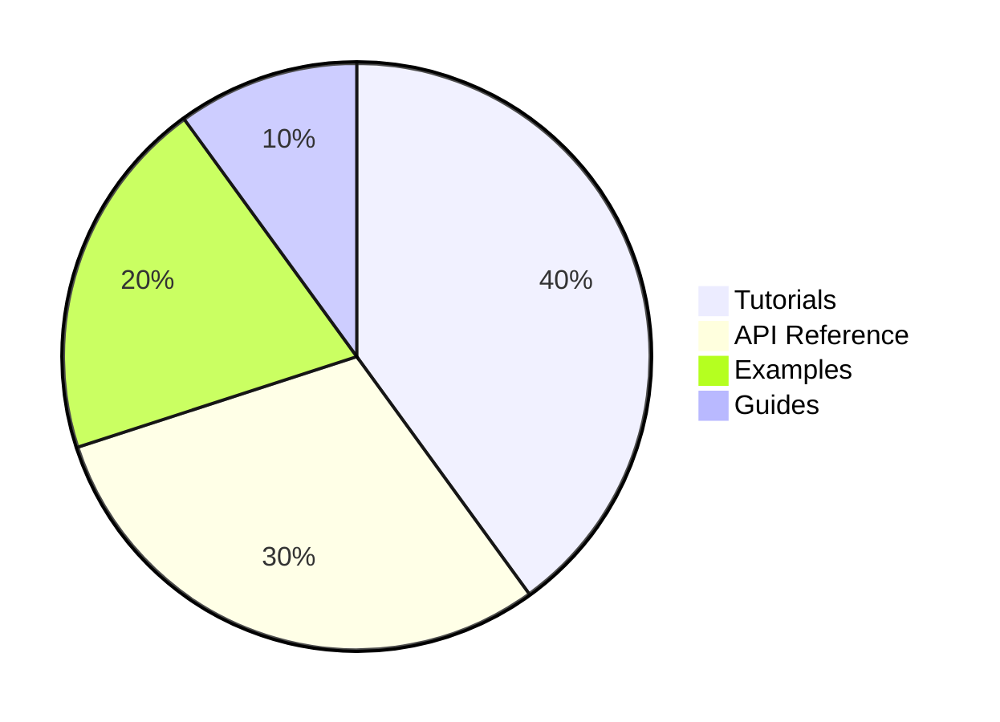
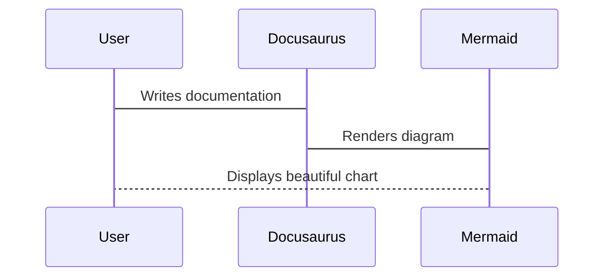

# Testing Configurations

As part of the technical evaluation criteria, features such as the creation of charts (Mermaid), folder structures, cross-reference, and new findings, are testing in order to identify the strenghts and weaknesses of documentation generator Docusaurus.

## Creating Mermaid Diagrams

Diagrams are rendered using Mermaid in a code block, following these steps:

1. Enabling the oficial Mermaid theme

```js title="docusaurus.config.js"
const config = {
  title: 'Hello Docs',
//new config
  markdown: {
    mermaid: true,
  },

  themes: ['@docusaurus/theme-mermaid'],
};
```

2. Installing the Theme

```bash
npm install @docusaurus/theme-mermaid

```

3. Generating Diagrams:

Simple FlowChart:



Documentation Content Types Pie:


Sequence Diagram:


>**Technical Considerations**

To enable Mermaid functionality in Docusaurus was necessary to install Mermaid theme ```npm install --save @docusaurus/theme-mermaid```, and configure it in ```docusaurus.js``` as shown in the  [Creating Mermaid Diagrams](#creating-mermaid-diagrams) section.

- Mermaid theme was simple to install.
- According to Docusaurus version used, somethimes Mermaid requires to enable in the ```docusaurus.js``` and restart the services, sometimes not, because ```remark-mermaid``` is already installed in the configuration.
- The ```` ```mermaid ```` syntax was critically important to tell Docusaurus how to process the code block.

```md
```mermaid
sequenceDiagram;
    participant User;
    participant Docusaurus;
    participant Mermaid;

User->Docusaurus: Writes documentation;
    Docusaurus->Mermaid: Renders diagram;
    Mermaid-->User: Displays beautiful chart; ```
```
- The difficulty of configuration was related to the type of diagram desired.
- Security issues were identified and detailes in the section [Security Concerns](#security-concerns).


## Reorder Sections and Pages

**Control Category**

To manage the order of each category in the sidebar, each section has a ```_category_.json``` inside its folder, with the number of the position as is the case of the ***technical-evaluation*** folder with the position number 2, or a front matter at the top with the sidebar position as the ***intro.md***.


- How painful is it to reorder sections later?

Establish new order sections can be easy for small projects, in fact Docusaurus by default autogenerates a sidebar from the docs folder structure to provide a basic structure as baseline to just move and rename folder. The difficulty will depend on the project structure and size, for example managing a sidebar manually with hundreds of pages or the use of absolute paths instead of relatives ones could become painful.


On the oher hand, Docusaurus support many sections and pages with the same number of order position, leaving the most recent first and the oldest last.

## Link Configurations

- How to link from one doc page to another? (relative paths, special syntax, auto-resolution by title?)

    Linking from one documentation page to another is very flexible:

    Using relative paths, syntax based ID, or auto-resolution using the filename as the doc ID:

    - Link to another folder based on the doc ID: [Installation Section](installation.md)

    ```md
    [Installation Section](installation.md)
    ```

    - Link from the same folder based on the filename: [Link Configurations](#link-configurations)

    ```md
    [Link Configurations](#link-configurations)
    ```

    

    *By default, link syntax resolves automatically using the *filename as the doc ID*, and works even if the file was moved, as long as the *doc ID* stays the same.*

    -  Using standard Markdown link syntax for external links:

    [GitHub Repository](https://github.com/emilarim/hello-docs).

    ```md
    [GitHub Repository](https://github.com/emilarim/hello-docs)
    ```

- What happens when a file is renamed or moved? - do links break silently?, or does the build warn it?

    When a File is renamed, an error is detected and reported by Docusaurus in the console:

    

    The platform prevents silent features, and control that behavior by default with the command ```onBrokenLinks: 'throw``` in docusaurus.config.js

    


## Security Concerns

After installing the package `@docusaurus/theme-mermaid` in the Node.js /npm ecosystem, 19 high severity vulnerabilities were reported that usually comes from dependencies of dependencies.


Running the `npm audit` command to identify dependencies with vulnerabilities:


> **[Download the detailed log](/logs/npmAuditReport.txt)**

### Analyzing Security Vulnerabilities

 Based on the NPM Audit Vulnerability Report: 

#### Root Vulnerability

| Severity | Package | Version | Issue | Fix Available |
|----------|---------|---------|-------|---------------|
| High | serialize-javascript | ≤ 7.0.2 | RCE via RegExp.flags and Date.prototype.toISOString() | `npm audit fix --force` |

#### Dependency Chain Impact

| Direct Package | Vulnerable Version | Depends On | Current Status |
|----------------|-------------------|------------|----------------|
| copy-webpack-plugin | 4.3.0 - 13.0.1 | serialize-javascript | Vulnerable |
| css-minimizer-webpack-plugin | ≤ 7.0.4 | serialize-javascript | Vulnerable |

#### Affected Docusaurus Packages

| Package | Affected Versions | Notes |
|---------|-------------------|-------|
| **@docusaurus/bundler** | All versions | Depends on vulnerable copy-webpack-plugin and css-minimizer-webpack-plugin |

#### Packages Dependent on @docusaurus/core

| Package | Affected Versions | Dependencies |
|---------|-------------------|--------------|
| @docusaurus/core | ≤0.0.0-6119, 3.5.2-canary-6121 - 3.5.2-canary-6131, ≥3.6.0-canary-6132 | Depends on @docusaurus/bundler |

#### Core Plugins Affected

| Plugin Category | Package Name | Affected Versions |
|-----------------|--------------|-------------------|
| **Content Plugins** | @docusaurus/plugin-content-blog | ≤0.0.0-6119, 3.5.2-canary-6121 - 3.5.2-canary-6131, ≥3.6.0-canary-6132 |
| | @docusaurus/plugin-content-docs | Same as above |
| | @docusaurus/plugin-content-pages | Same as above |
| **Theme Plugins** | @docusaurus/theme-classic | Same as above |
| | @docusaurus/theme-mermaid | Same as above |
| | @docusaurus/theme-search-algolia | Same as above |
| **SEO & Analytics** | @docusaurus/plugin-google-analytics | Same as above |
| | @docusaurus/plugin-google-gtag | Same as above |
| | @docusaurus/plugin-google-tag-manager | Same as above |
| | @docusaurus/plugin-sitemap | Same as above |
| **Utility Plugins** | @docusaurus/plugin-debug | Same as above |
| | @docusaurus/plugin-css-cascade-layers | Same as above |
| | @docusaurus/plugin-svgr | Same as above |

#### Preset Package

| Package | Affected Versions | Dependencies |
|---------|-------------------|--------------|
| @docusaurus/preset-classic | ≤0.0.0-6119, 3.5.2-canary-6121 - 3.5.2-canary-6131, ≥3.6.0-canary-6132 | Depends on all core and content plugins listed above |

#### Summary Impact

| Metric | Count |
|--------|-------|
| **Total Vulnerabilities** | 19 (High severity) |
| **Root Vulnerable Package** | 1 (serialize-javascript) |
| **Direct Dependencies Affected** | 2 (copy-webpack-plugin, css-minimizer-webpack-plugin) |
| **Docusaurus Packages Affected** | 15+ |
| **Breaking Change Required** | Yes (will install @docusaurus/core@3.5.2) |

### Recommended Action

1. Try to fix first:

Running the `npm audit fix` in order to update *only compatible dependency versions*, respect the *version ranges defined in `package.json`*, avoid *breaking changes*, and install *minor or patch updates only*.


2. As the vulnerabilities remain, the next step consisted of updating Docusaurus Core:


3. Last resort (may include breaking changes):
Running the `npm audit fix --force` in order to allows *major upgrades*, and modify the dependency tree *drastically*.

- As a countermeasure the docusaurus website on GitHub ws updated, in case of revert changes could be neccesary.

After running the `npm audit-fix --force` command, audit report registered 17 vulnerabilities (13 moderate, 4 high), which results a considerable decrease of high alerts.


However, the website registered loading issues:


Starting the development server reported errors due to `field(s) ("future.v4",)` are not recognized in docusaurus.config.js.


Checking audit report and following the recomendations at the audit report about fix available via `npm audit fix`, it was this command running again without changes.


Proceed to upgrade Docusaurus to the latest version, and as result returning to the initial state with the 19 high severity vulnerabilities.


**SUMARY**

Although the platform is able to identify and report vulnerability issues, it is unable to fix them through its mechanisms `npm audit fix` and `npm audit fix--force`, in fact the `--force` flag allows audit fix to install modules outside of the stated dependency range that generate errors to start the server.

As a countermeasure to manage vulnerabilities, its necesary to inspect each dependency with vulnerabilities, list all its dependencies, check its repository for a version that includes a fix, update the dependency without altering unrelated packages, and testing the correct functioning of the website.


