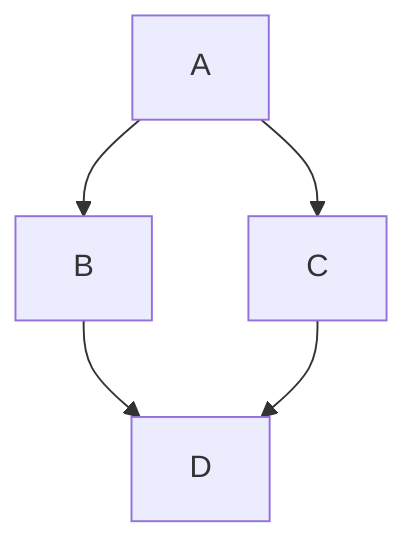
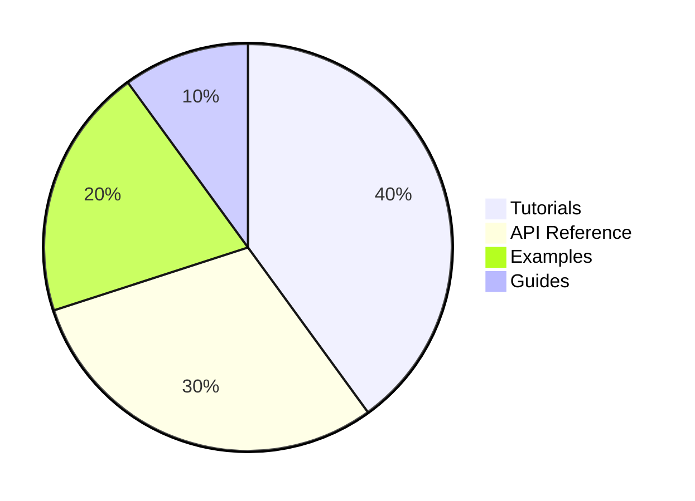
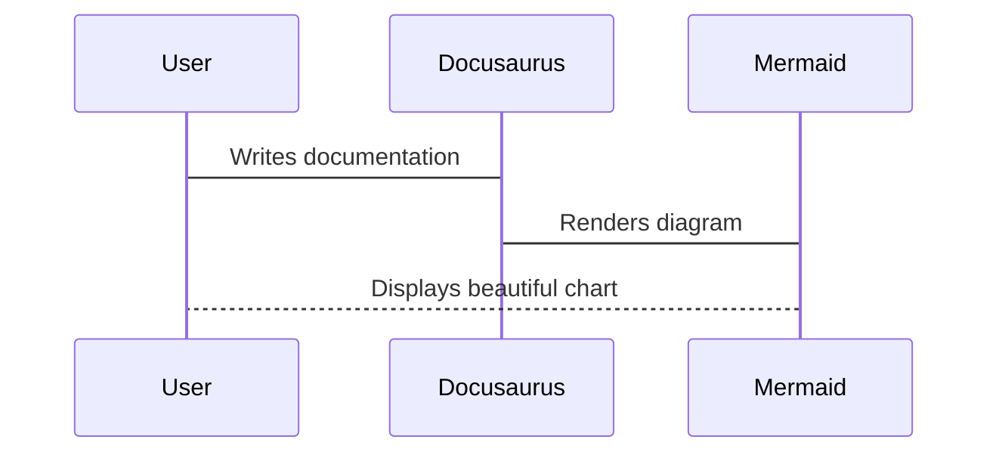

# Testing Configurations

As part of the technical evaluation criteria, features such as chart creation (Mermaid), folder structures, cross-referencing, and new findings were tested in order to identify the strenghts and weaknesses of the Docusaurus documentation generator.

1. Enabling the Official Mermaid Theme

## Creating Mermaid Diagrams

Diagrams are rendered using Mermaid within a code block by following these steps:

1. Enabling the Oficial Mermaid Theme

```js title="docusaurus.config.js"
const config = {
  title: 'Hello Docs',
//new config
  markdown: {
    mermaid: true,
  },

  themes: ['@docusaurus/theme-mermaid'],
};
```

2. Installing the Theme

```bash
npm install @docusaurus/theme-mermaid

```

3. Generating Diagrams:

Simple FlowChart:



Documentation Content Types Pie:


Sequence Diagram:


>**Technical Considerations**

To enable Mermaid functionality in Docusaurus, it was necessary to install the Mermaid theme ```npm install --save @docusaurus/theme-mermaid```, and configure it in ```docusaurus.js```, as shown in the  [Creating Mermaid Diagrams](#creating-mermaid-diagrams) section.

- Mermaid theme was simple to install.
- Depending on the Docusaurus version used, somethimes Mermaid needs to be enabled in the ```docusaurus.js``` and the services restarted. In other cases, this step is unnecessary because ```remark-mermaid``` may already be included in the configuration.
- The ```` ```mermaid ```` syntax is critically important because it tells Docusaurus how to process the code block.

    Example:


    ```md
    ```mermaid
    sequenceDiagram;
        participant User;
        participant Docusaurus;
        participant Mermaid;

    User->Docusaurus: Writes documentation;
        Docusaurus->Mermaid: Renders diagram;
        Mermaid-->User: Displays beautiful chart; ```
    ```
- The difficulty of configuration is mainly related to the type of diagram being created..
- Security issues were identified and are detailed in the section [Security Concerns](#security-concerns).


## Reorder Sections and Pages

**Control Category**

To manage the order of each category in the sidebar, each section has a ```_category_.json``` file inside its folder. This file specifies the position number of the category. For example, the ***technical-evaluation*** folder has position number 2.

Alternatively, the order can be defined using the front matter at the top of a page with the sidebar_position paramter, as in ***intro.md***.


- How difficult is it to reorder sections later?

Establishing a new order for sections can be easy in small projects. In fact, Docusaurus automatically generates a sidebar from the docs folder structure by default, providing a basic structure that allows folders to be moved and renamed easily.

However, the level of difficulty depends on the project structure and size. For example, manually managing a sidebar with hundreds of pages, or using absolute paths instead of relatives ones, can become difficult and time-consuming.


On the oher hand, Docusaurus support multiple sections and pages with the same order position number. In this case, the most recently added items appear first, while older items appear later.

## Link Configurations

- How can you link from one documentation page to another? (relative paths, special syntax, auto-resolution by title?)

Linking from one documentation page to another in Docusaurus is very flexible. It supports relative paths, syntax based on document IDs, and auto-resolution using the filename as the doc ID.

    - Link to a document using its relative path: [Installation Section](installation.md)

        ```md
        [Installation Section](installation.md)
        ```

    - Link to a section within the same document using an anchor: [Link Configurations](#link-configurations)

        ```md
        [Link Configurations](#link-configurations)
        ```

        

    *By default, the link syntax resolves automatically using the *filename as the doc ID*, and it continues to work even if the file is moved, as long as the *doc ID* remains the same.*

    -  Using standard Markdown link syntax for external links:

        [GitHub Repository](https://github.com/emilarim/hello-docs).

        ```md
        [GitHub Repository](https://github.com/emilarim/hello-docs)
        ```

- What happens when a file is renamed or moved? Do links break silently, or does the build warn about it?

    When a File is renamed or moved, Docusaurus detects the issue and reports an error in the console:

    

    The platform prevents silent features and control this behavior by default using the configuration option ```onBrokenLinks: 'throw``` in docusaurus.config.js.

    


## Security Concerns

After installing the package `@docusaurus/theme-mermaid` in the Node.js /npm ecosystem, 19 high severity vulnerabilities were reported. These vulnerabilities typically originate from transitive dependencies (dependencies of dependencies).


Running the `npm audit` command helps to identify which dependencies contain vulnerabilities:


> **[Download the detailed log](/logs/npmAuditReport.txt)**


### Analyzing Security Vulnerabilities

 Based on the NPM Audit Vulnerability Report: 

#### Root Vulnerability

| Severity | Package | Version | Issue | Fix Available |
|----------|---------|---------|-------|---------------|
| High | serialize-javascript | ≤ 7.0.2 | RCE via RegExp.flags and Date.prototype.toISOString() | `npm audit fix --force` |

#### Dependency Chain Impact

| Direct Package | Vulnerable Version | Depends On | Current Status |
|----------------|-------------------|------------|----------------|
| copy-webpack-plugin | 4.3.0 - 13.0.1 | serialize-javascript | Vulnerable |
| css-minimizer-webpack-plugin | ≤ 7.0.4 | serialize-javascript | Vulnerable |

#### Affected Docusaurus Packages

| Package | Affected Versions | Notes |
|---------|-------------------|-------|
| **@docusaurus/bundler** | All versions | Depends on vulnerable copy-webpack-plugin and css-minimizer-webpack-plugin |

#### Packages Dependent on @docusaurus/core

| Package | Affected Versions | Dependencies |
|---------|-------------------|--------------|
| @docusaurus/core | ≤0.0.0-6119, 3.5.2-canary-6121 - 3.5.2-canary-6131, ≥3.6.0-canary-6132 | Depends on @docusaurus/bundler |

#### Core Plugins Affected

| Plugin Category | Package Name | Affected Versions |
|-----------------|--------------|-------------------|
| **Content Plugins** | @docusaurus/plugin-content-blog | ≤0.0.0-6119, 3.5.2-canary-6121 - 3.5.2-canary-6131, ≥3.6.0-canary-6132 |
| | @docusaurus/plugin-content-docs | Same as above |
| | @docusaurus/plugin-content-pages | Same as above |
| **Theme Plugins** | @docusaurus/theme-classic | Same as above |
| | @docusaurus/theme-mermaid | Same as above |
| | @docusaurus/theme-search-algolia | Same as above |
| **SEO & Analytics** | @docusaurus/plugin-google-analytics | Same as above |
| | @docusaurus/plugin-google-gtag | Same as above |
| | @docusaurus/plugin-google-tag-manager | Same as above |
| | @docusaurus/plugin-sitemap | Same as above |
| **Utility Plugins** | @docusaurus/plugin-debug | Same as above |
| | @docusaurus/plugin-css-cascade-layers | Same as above |
| | @docusaurus/plugin-svgr | Same as above |

#### Preset Package

| Package | Affected Versions | Dependencies |
|---------|-------------------|--------------|
| @docusaurus/preset-classic | ≤0.0.0-6119, 3.5.2-canary-6121 - 3.5.2-canary-6131, ≥3.6.0-canary-6132 | Depends on all core and content plugins listed above |

#### Summary Impact

| Metric | Count |
|--------|-------|
| **Total Vulnerabilities** | 19 (High severity) |
| **Root Vulnerable Package** | 1 (serialize-javascript) |
| **Direct Dependencies Affected** | 2 (copy-webpack-plugin, css-minimizer-webpack-plugin) |
| **Docusaurus Packages Affected** | 15+ |
| **Breaking Change Required** | Yes (will install @docusaurus/core@3.5.2) |

### Recommended Actions to Follow

1. Try to fix first

Run `npm audit fix` to update *only compatible dependency versions*, respect the *version ranges defined in `package.json`*, avoid *breaking changes*, and install *minor or patch updates only.*

    

2. Update Docusaurus Core

If vulnerabilities remain, the next step is to update Docusaurus Core:

    

3. Last resort (may include breaking changes)
Run `npm audit fix --force` to allow *major upgrades*, and modify the dependency tree *drastically*.

> As a precaution, the Docusaurus website on GitHub was updated. If necessary, revert changes to restore functionality.

### Results and Findings

1. After running `npm audit-fix --force`, the audit report registered 17 vulnerabilities (13 moderate, 4 high), representing a significant reduction in high-severy alerts.

    

    However, the website experienced loading issues:

    

2. Starting the development server reported errors due to unrecognized fields `("future.v4",)` in `docusaurus.config.js`.

    

3. Running `npm audit fix` again, following the audit report's recommendations, made no further changes.

    

4. Upgrading Docusaurus to the latest version restored the initial state, with the 19 high-severity vulnerabilities returning.

    

    

5. A warning related to critical dependency in ```vscode-languageserver-types``` appears after upgrading.

    

6. Communication with GitHub portal to upgrade the website was disabled and required re-establishing authentication. 

**CONCLUSIONS**

Although the platform can identify and report vulnerabilities, it cannot reliably fix them using `npm audit fix` or `npm audit fix--force`. The `--force` flag may install modules outside the stated dependency range, which can generate errors that prevent the server from starting.

As a countermeasure, it is necessary to:

- Inspect each dependency with reported vulnerabilities.

- List all transitive dependencies.

- Check the repository for versions that include a fix.

- Update dependencies without altering unrelated packages.

- Test the website thoroughly to ensure correct functionality.


